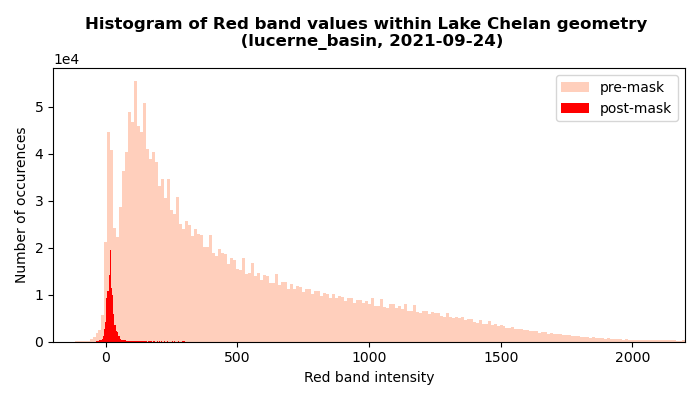
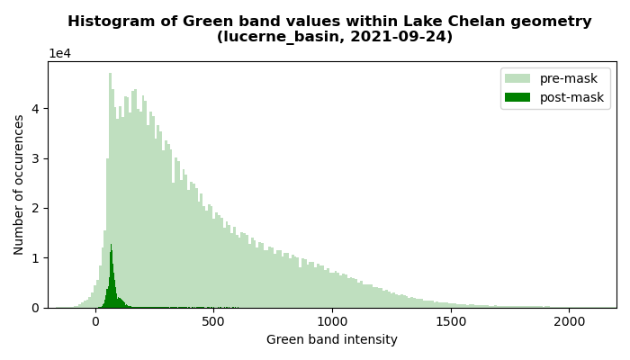
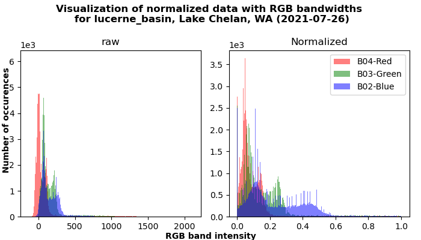
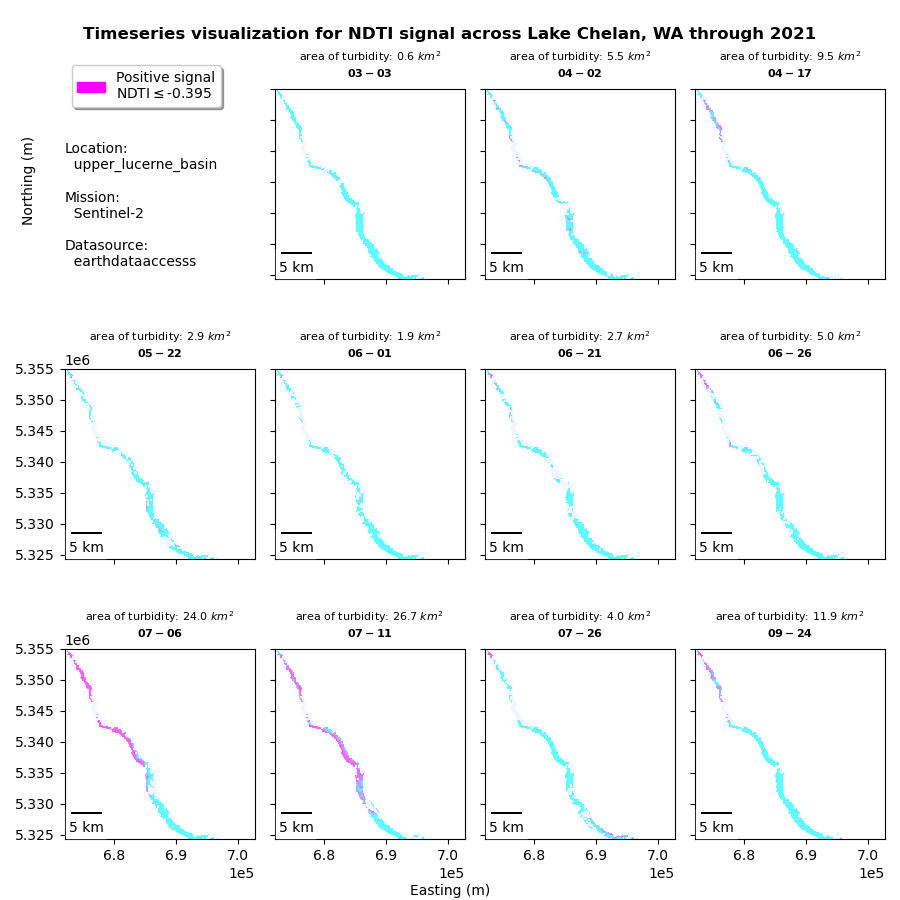

  
 
<figcaption align = "left"><b>Fig.1 - Elevated drone view of Wapato Basin, Lake Chelan, WA. [1]</b></figcaption>  
  

# Project Chelanigans  
---

### Assessing temporal variability in glacial turbidity through Sentinel-2 rasterized data for Lake Chelan, WA   

## Team: Jason MacDonald  

## Short summary  
During the 2021 Pacific Northwest heatwave from June 22 to July 2, the glaciers which feed Lake Chelan likely underwent some level of rapid melt event. When such an event occurs, fine grained sediment, called glacial flour, will be transported with the meltwater to the lake [2]. This causes the lake to be cloudy which blocks light attenuation, disrupting several biotic processes [2][3][4]. This study will attempt to quantify the abundance of glacial till turbidity within a glacially fed lake; before, during, and after a presumed rapid glacial melt event. 

## Background  
 
Lake Chelan is located on the eastern slopes of the North Cascades. The slow ebb and flow of glaciers across millenia is the incredible force that formed the third deepest freshwater lake in the United States. This unique origin separates Lake Chelan into two basins: the Lucerne Basin to the northwest, and the Wapato Basin to the southeast. Figure 2 below shows the Lucerne Basin which encompasses the upper ~75% of the lake's reach and is much deeper than the Wapato Basin, reaching a maximum depth of 1486 ft. The Wapato Basin is much more shallow, with an average depth of 190 ft. [5]

  
<figcaption align = "left"><b>Fig.2 - Natural-color composition locale map for Lucerne Basin, Lake Chelan, WA (2021-07-11).</b></figcaption>  
  

Lake Chelan has historically been an oligotrophic lake, meaning it is not highly productive in terms of algal growth and maintains a fairly clear water column [5]. Glacial meltwater commonly contains fine grained sediment, called glacial flour, which formed over millenia of weathering under the immense pressure of these glaciers [2]. As glaciers warm, the meltwater will transport glacial flour to the lake [2]. Glacial flour is so fine, that it stays suspended in the water column, much like silt. This cloud of suspended particles is measured as turbidity. When a lake becomes turbid, with sediment or organic matter, the cloudiness of the lake blocks light attenuation, disrupting several biotic processes [2][3][4].  

In addition to turbidity, glacial flour is also known to contain high concentrations of phosphorus [2][4]. Phosphorus is often a limiting nutrient and additional sources of phosphorus will often lead to phytoplankton blooms [2]. The increased influx of glacial flour caused by climate change will create more turbid waters and likely disrupt biogeochemical balances which will ultimately impact aquatic life negatively.  

While the Wapato Basin is much more populated than the Lucerne Basin, and therefore has a greater influx of pollutants, the biogeochemistry of the Lucerne Basin is also of great interest because 
1. the Wapato Basin is downstream from the Lucerne Basin
2. it offers a potential glimpse into the effects of global climate change on a glacially fed, oligotrophic lake.

As water is a dark target from space, it is extremely difficult to assess water quality using satelite imagery. However, it has been shown that changes in turbidity can be tracked by satelite imagery using ratios of raster bands from the visible and near-infrared spectra [6][7][8]. 

## Objectives  
1. Identify temporal trends in glacial flour turbidity (Lucerne Basin)   
2. Identify temporal trends in benthic algae coverage (Wapato Basin)   

## Datasets  
For this analysis, Sentinel-2 data was utilized due to its 10m spatial resolution.  
Sentinel-2. https://cloud.google.com/storage/docs/public-datasets/sentinel-2#dataset_access [9]     
base URL https://storage.googleapis.com/gcp-public-data-landsat/LC08/01 

In the future, I would like to utilize the HLS and include the additional 11 shots from Landsat-8
Harmonized Landsat-8 & Sentinel-2 (HLS) [10]  
https://cmr.earthdata.nasa.gov/cloudstac/LPCLOUD
https://gist.github.com/scottyhq/efd583d66999ce8f6e8bcefa81545b8d  

## Tools and packages  
1. Numpy  
https://numpy.org/  
2. Pandas  
https://pandas.pydata.org/  
3. GeoPandas  
https://geopandas.org/  
5. ODC  
https://odc-stac.readthedocs.io/en/latest/
6. Pystac  
https://pystac.readthedocs.io/en/stable/
7. Holoviews  
https://holoviews.org/
8. Xarray  
https://xarray.dev/
9. fsspec  
https://pypi.org/project/fsspec/
10. ast  
https://pypi.org/project/AST/
11. os  
https://pypi.org/project/os-sys/
12. urllib  
https://www.geeksforgeeks.org/python-urllib-module/
13. datetime  
https://pypi.org/project/DateTime/
14. Rasterio  
https://rasterio.readthedocs.io/en/latest/api/rasterio.html  
15. matplotlib_scalebar.scalebar  
https://pypi.org/project/matplotlib-scalebar/
16. matplotlib.patches  
https://matplotlib.org/stable/api/patches_api.html
17. earthaccess  
https://github.com/nsidc/earthaccess

## Planned approach  
* Phase 1
    1. Develop script to access all relevant HLS data from NASA  
    2. Filter images with more than 10% cloud cover  
    3. Adjust window extents
* Phase 2    
    1. Find correct rgb/nir ratios to identify benthic algae (or glacial till with alternative)  
    2. Develop a notebook that will track temporal changes in abundance (area) and/or intensity  
    3. Create a timeseries to visualize seasonal and annual changes since 2016  

## Expected outcomes  
1. Visualize the apparent increase in glacial turbidity 
2. Proof of concept for combining on-site limnological study with geospatial data analysis

## Methodology
The following section explains the methodology behind the analysis in each notebook.
NOTE: In general, notebooks are organized with install/import commands at the top, followed by required inputs with instructions. The minimum required input is window and window_id, to choose the window about which you wish to analyze and a name for that area. Pertinent output is saved to the output folder and organized by date and location.
* ### chelan_0_query-data  
    Notebook 0 queries Earthdata using pystac_client and returns a dataframe of all the available Landsat-8 (HLSL) and Sentinel-2 (HLSS). The dataframe is then filtered for shots with less than 20% cloud cover. This filtered dataframe is saved to the output folder for use in subsequent notebooks as `gf_lesscloud_20_sentinel_df`.   
* ### chelan_1_site-exploration  
    Notebook 1 is designed to explore the area of interest, find noteable landmarks, and create beautiful maps for publication. This notebook utilizes the stac_id's from the gf_lesscloud_20_sentinel_df dataframe to access each image and associated date-time.  
    NOTE: currently, rasters must be downloaded and saved to the 'data' folder. Rasters can be downloaded by clicking on each blue link produced by Cell 15.  
    To separate the signals produced over water from those produced over land, a geojson of Washington lakes is downloaded from WSDOT. NOTE: this must be done manually currently; follow link provided or download separately.  
    The geojson is reprojected to match our crs, then the Lake Chelan geometry is isolated and converted into a mask.  
    For each plotting block of code, a `for` statement loops through each raster image as it loads the selected window, normalizes the red, green, and blue colors, and stacks them in order for plotting.  
* ### chelan_2_rgb-analysis  
    Notebook 2 is designed to explore the different color signals (RGB) produced over Lake Chelan, as well as examine the relationship between Normalized Difference Index (NDI) ratios and expected turbidity. NDIs like NDTI for Turbidity and NDSSI for Suspended Solids operate through bandwidth ratios. The equations for NDTI and NDSSI are given below:  
    
        NDTI = (red-green)/(red+green)  [6]  
        NDSSI = (blue-nir)/(blue+nir)   [7]  
        
    Talk about why different color wavelengths matter here..
    The key to success is proper order of operations. Again, images are pulled from notebook 0 dataframe and a window is chosen for the area of interest. The mask is created from geojson file. The mask is then applied to each band of interest before being normalized.  
    The main attraction here is the final plot comparing signals for turbidity between the index ratios. This plot may be used to determine the signal for turbidity by comparing results from a known turbid event and a known clear water day.  
    
* ### chelan_3_timeseries-visualization  
(this notebook needs work)  

* ### chelan_4_affected-area-analysis  
    Notebook 4 is designed to analyze the signal and assess area of impact about Lake Chelan. Notebook 4 operates in much the same way as Notebooks 2 and 3 (df->window->mask->apply band-ratios). However, in this notebook, we will evaluate the NDTI and NDSSI signals as a whole. To accomplish this, histograms of NDTI and NDSSI values are plotted and thresholds for each index are determined from the resulting asymptote.  
    Next, a timeseries of each index signal is produced for the year, and signals of turbidity are assessed. Finally, a signal comparison between NDTI and NDSSI is plotted in conjunction with PNW Heatwave time period.
  
## Results  
The following section provides raw summary results. Captions describe each figure. Discussion of results is held for discussion section.  
### chelan_0_query-data  

 <figcaption align = "left"><b>Fig.3 - A visualization of available Landsat-8 and Sentinel-2 shots provided with the HLS notebook.</b></figcaption>  
    

 <figcaption align = "left"><b>Fig.4 - A visualization of available Landsat-8 and Sentinel-2 shots after filtering for shots with less than 20% cloud cover.</b></figcaption>  
    

### chelan_1_site-exploration  

   
<figcaption align = "left"><b>Fig.5 - A timeseries representation of the natural-color composite images for Lucerne Basin, Lake Chelan, Wa.</b></figcaption>  
    

### chelan_2_rgb-analysis  

   
<figcaption align = "left"><b>Fig.6- A comparison of histograms of red band wavelength values when sampled across the entire raster versus sampling only masked values about the body of Lake Chelan, as defined by USGS polygon.</b></figcaption>  
    

   
<figcaption align = "left"><b>Fig.7 - A comparison of histograms of green band wavelength values when sampled across the entire raster versus sampling only masked values about the body of Lake Chelan, as defined by USGS polygon.</b></figcaption>  
    

   
<figcaption align = "left"><b>Fig.8 - A comparison of histograms of blue band wavelength values when sampled across the entire raster versus sampling only masked values about the body of Lake Chelan, as defined by USGS polygon.</b></figcaption>  
    

 
<figcaption align = "left"><b>Fig.9 - Combined RBG signals as sampled about the body of Lake Chelan, as defined by USGS polygon.</b></figcaption>  
    

   
<figcaption align = "left"><b>Fig.10 - A potential teaching tool for the visualization of the need for and result of normalization.</b></figcaption>  
    

 
<figcaption align = "left"><b>Fig.11 - A comparison of index ratios and classification of signals from NDTI and NDSSI.</b></figcaption>  
    

### chelan_3_timeseries-visualization  
(this notebook needs work)
  
### chelan_4_affected-area-analysis  

   
<figcaption align = "left"><b>Fig.12 - Model configuration histogram without pre-normalization.</b></figcaption>  
    

  
<figcaption align = "left"><b>Fig.13 - Model configuration histogram with pre-normalization.</b></figcaption>  
    

   
<figcaption align = "left"><b>Fig.14 - Timeseries of NDTI threshold mask, showing influx of turbidity in upper Lucerne Basin, Lake Chelan, WA.</b></figcaption>  
    

  
<figcaption align = "left"><b>Fig.15 - Timeseries of NDSSI threshold mask, showing influx of suspended solids in upper Lucerne Basin, Lake Chelan, WA.</b></figcaption>  
    

  
<figcaption align = "left"><b>Fig.16 - Timeseries of NDTI vs NDSSI signals in Lucerne Basin, Lake Chelan, WA.</b></figcaption>  
    

## Discussion
 
### chelan_2_rgb-analysis 
This notebook provides some of the most clear visuals of the "dark-target" that is water. Figures 6, 7, and 8 helped me understand the sheer magnitude of difference between the light reflecting from the water versus that which reflects from land.  
Additionally, Figure 11 will help illustrate a clear separation between the signals reflected from clear water, and those reflected from turbid water.

### chelan_3_timeseries-visualization  
(this notebook needs work)
The values seem to be constant across all time. Something is not plotting right again. Will have to revisit later.

### chelan_4_affected-area-analysis  
First, the signal threshold analysis for NDTI and NDSSI were a success. The initial ("wrong") signal threshold analysis produced relatively close results for NDTI threshold (-0.35 compared to -0.395). However, the NDSSI threshold of 0.567 showed significant improvement in capturing some signal related to suspendded solids, albeit different from that of NDTI.  

It seems I have detected some signal of turbidity (potentially from glacial melt and glacial flour). In short, the heatwave here in 2021 led to a spike in Normalized Difference Turbidity Index (red - green / red + green) in Lake Chelan. In Figure 14 for NDTI, July 6th and 11th show a pink area of turbidity passing from top left toward bottom right. The same dates for NDSSI do not correlate as nicely however. It seems that the two indices detect different substances, which is logical as they are based on different wavelengths. The next step would be connecting these raster index signals with field data (i.e. secci depth). Additionally, another step would be to characterize different causes of turbidity and determine if each NDI is detecting a different form (such as glacial flour from headwaters vs muddy side stream hit with heavy rain).

## Lessons Learned  
  * Try stage your code to handle pairs or triplets. This makes it easier to scale up when ready.
  * Try to avoid downloads from the beginning. This will be easier than beginning with downloads and readapting back to a more efficient way.
  * Even working with github, do yourself a favor and make a copy of the block of code you're about to edit. If there are any mistakes, you can revert back quickly.  
  * Alway check internal documentation and tab-fill before googling solutions
  * Do reasearch early and often
  * Try to sleep the night before you presentation
  
## Ongoing Work

This project has been the beginning stages of what will hopefully becomean ongoing PhD research study. Ongoing work directly related to this project would include:
1. Automate chelan geometry download (maybe look for different source)
2. Resolve authentication from earthdata to fully automate the notebooks
3. Load data on the fly and remove need to download files
4. chelan_1_site-exploration.ipynb  
 i. add sampling locations to site map  
 ii. add points of interest to site map
 iii. add chelan geom to site map to show orientation (i.e. Lucerne Basin excluding Wapato Basin
 iv. add watershed geom
 v. upgrade scalebar
 vi. upgrade cardinal symbol
5. chelan_2_rgb-analysis  
 i.  resolve issue with index ratio comparison figure
6. chelan_3_timeseries-visualization  
 i. revisit these plots
7. chelan_4_affected_area_analysis  
 i. resolve how to add background over mask (currently hidden by mask)  
 ii. swap y1/y2 axis in NDTI/NDSSI signal figure  
 iii. remove "(right)" from y2 (NDSSI) axis label  
 iv. scale this up to include the entire Lucerne Basin  
8. scale this analysis to include all shots over time   
 i. use this to analyze temporal trends in glacial turbidity
 ii. long-term mean, current deviation from ltmean

## Future-Work  

1) Collect available turbidity field data from Lake Chelan Research Institute and match with GDA results.
2) Organize turbidity sampling events planned during and shortly after extreme warming events. Synchronize this with days when Sentinel-2 is passing over Lake Chelan. I can then use that data to calibrate the model, or to verify if already calibrated.
3) Sample phosphorus concentrations before, during, and after these events. 
4) Perform regression analysis of ambient Temp vs NDTI and ambient Temp vs Phosphorus. (It seems possible that the extreme heat events we are having contribute to an increased flux of P into Lake Chelan and other glacially fed lakes.)

## References  
[1] https://www.visitchelancounty.com/lake-chelan#iLightbox[gallery_image_1]/0

[2] E. B. Welch and J. M. Jacoby, Pollutant Effects in Freshwater: Applied Limnology, London: Spon Press, 2004. 

[3]
Sommaruga, R., Kandolf, G. "Negative consequences of glacial turbidity for the survival of freshwater planktonic heterotrophic flagellates." Sci Rep 4, 4113 (2014). https://doi.org/10.1038/srep04113  

[4]
Laird, K.R., Barouillet, C., Cumming, B.F. et al. "Influence of glacial turbidity and climate on diatom communities in two Fjord Lakes (British Columbia, Canada)." Aquat Sci 83, 13 (2021). https://doi.org/10.1007/s00027-020-00767-3  

[5]
Jean M. Jacoby, Debra D. Bouchard & Clayton R. Patmont "Response of Periphyton to Nutrient Enrichment in Lake Chelan, WA," Lake and Reservoir Management, 7:1, 33-43, 1991, DOI: 10.1080/07438149109354252  

[6]
C. Baughman, B. Jones, K. Bartz, D. Young, and C. Zimmerman, “Reconstructing Turbidity in a Glacially Influenced Lake Using the Landsat TM and ETM+ Surface Reflectance Climate Data Record Archive, Lake Clark, Alaska,” Remote Sensing, vol. 7, no. 10, pp. 13692–13710, Oct. 2015, doi: 10.3390/rs71013692.

[7]
Hossain, AKM & Jia, Yafei & Chao, Xiaobo. "Development of Remote Sensing Based Index for Estimating/Mapping Suspended Sediment Concentration in River and Lake Environments," September 2010
Conference: 8th International Symposium on ECOHYDRAULICS (ISE 2010)Volume: Paper No. 0435, pp. 578-585.

[8]
Bid, Sumanta & Siddique, Giyasuddin. (2019). Identification of seasonal variation of water turbidity using NDTI method in Panchet Hill Dam, India. Modeling Earth Systems and Environment. 5. 10.1007/s40808-019-00609-8. 

[9]
Overview of sentinel-2
https://sentinels.copernicus.eu/web/sentinel/user-guides/sentinel-2-msi/overview 

[10]
Harmonized Landsat-8 Sentinel-2 (HLS) Product User's Guide
https://hls.gsfc.nasa.gov/wp-content/uploads/2017/08/HLS.v1.3.UserGuide_v2-1.pdf
  

---

not used yet  
[11]
Jassby, Alan D., Goldman, Charles R., Reuter, John E., Richards, Robert C., "Origins and scale dependence of temporal variability in the transparency of Lake Tahoe, California–Nevada," Limnology and Oceanography, 2, 1999, doi: 10.4319/lo.1999.44.2.0282.

[12]
Martin Claverie, Junchang Ju, Jeffrey G. Masek, Jennifer L. Dungan, Eric F. Vermote, Jean-Claude Roger, Sergii V. Skakun, Christopher Justice, "The Harmonized Landsat and Sentinel-2 surface reflectance data set." Remote Sensing of Environment, Volume 219, 2018, Pages 145-161, ISSN 0034-4257, https://doi.org/10.1016/j.rse.2018.09.002. (https://www.sciencedirect.com/science/article/pii/S0034425718304139)

[13]
M. Reif, B. Krumwiede, S. Brown, E. Theuerkauf, and J. Harwood, “Nearshore Benthic Mapping in the Great Lakes: A Multi-Agency Data Integration Approach in Southwest Lake Michigan,” Remote Sensing, vol. 13, no. 15, p. 3026, Aug. 2021, doi: 10.3390/rs13153026.

[14]
C. J. Legleiter and S. W. Hodges, “Mapping Benthic Algae and Cyanobacteria in River Channels from Aerial Photographs and Satellite Images: A Proof-of-Concept Investigation on the Buffalo National River, AR, USA,” Remote Sensing, vol. 14, no. 4, p. 953, Feb. 2022, doi: 10.3390/rs14040953.

[15]
Sachidananda Mishra, Deepak R. Mishra, "Normalized difference chlorophyll index: A novel model for remote estimation of chlorophyll-a concentration in turbid productive waters," Remote Sensing of Environment, Volume 117, 2012, Pages 394-406, ISSN 0034-4257, https://doi.org/10.1016/j.rse.2011.10.016.

[16]
Yvonne Vadeboncoeur, Marianne V. Moore, Simon D. Stewart, et al, "Blue Waters, Green Bottoms: Benthic Filamentous Algal Blooms Are an Emerging Threat to Clear Lakes Worldwide," BioScience, Volume 71, Issue 10, October 2021, Pages 1011–1027, https://doi.org/10.1093/biosci/biab049.

[17]
Le, Chengfeng & Lehrter, John & Hu, Chuanmin & Murrell, Michael & Qi, Lin. "Spatiotemporal chlorophyll-a dynamics on the Louisiana continental shelf derived from a dual satellite imagery algorithm." Journal of Geophysical Research: Oceans. 119. (2014). doi: 10.1002/2014JC010084. 